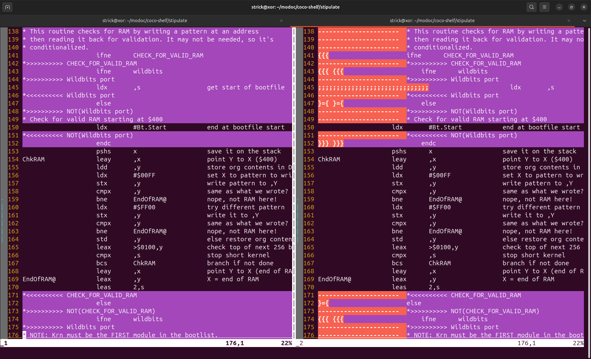
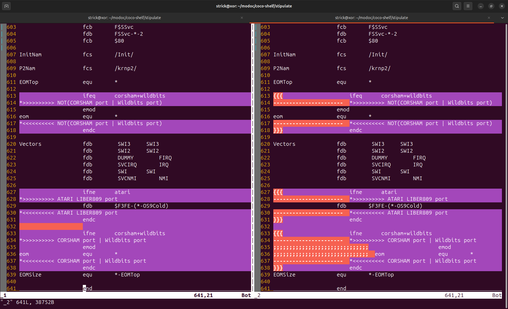

# stipulate
Show clearly what lines are active, for lwasm source files, given a set of symbol pre-definitions.

Run your .asm file through this filter, into the stdin, and capture
the stdout.  Use `-D symbol` or `-D symbol=value` command-line flags to
specify symbols you want to predefine.  The first form assigns a default
value of 1.

Then use `vimdiff` to compare your original file with the output of the filter.
Lines that are unchanged between the two versions are the active lines
that `lwasm` will assemble.

Lines that `vimdiff` marks as "changed" are in these categories:

*   Comments:  Lines that are only comments are preceeded with `--------------------`.

*   Conditional Directives: The directives like `if`, `ifne`, `else`, and `endc` are preceeded
    by braces such as `{{{`, `}={`, and `}}}` to help you see the nesting
    of directives.

*   Inactive:  Lines that are not active due to conditional directives are
    preceeded by `;;;;;;;;;;;;;;;;;;;;;;;;;;;;;;`.

*   Lines containing only some white space in the original file highlight the white space.
    You might want to consider deleting the white space.

It is intended that you will edit the original file, not the filter
output.  There is currently no inverse operation to convert the filter
output back into assembly source.  Consider it read-only.

## Example

Here the original source is on the left and the filter output is on the right.

The command line defines `atari` to be `1` and `CHECK_FOR_VALID_RAM` to be `1`.

These are the sample command lines:

```
$ cd ~/modoc/coco-shelf/stipulate
$ cp ~/modoc/coco-shelf/nitros9/level1/modules/kernel/krn.asm _1
$ go run stipulate.go < _1 > _2 -D atari -D CHECK_FOR_VALID_RAM=1
$ vimdiff _1 _2
```

In each of the screenshots below, the lines with a dark background color
are the active lines that are actually assembled.

You may choose to mentally focus on the left hand side, which is visually
simpler, or on the right hand side, which uses prefixes (in Orange)
to show the nesting of directives, `----` marks for comment lines, and
`;;;;` marks for skipped lines.




